MultiBranch Action Triggers Plugin
==================================

This plugin enables building/triggering other jobs when a Pipeline job is created or deleted,
or when a Run (also known as Build) is deleted by a Multi Branch Pipeline Job.

Summary
=======
Multi Branch Pipeline Jobs are capable of creating/deleting Pipelines depending on the branches in the repository.
They also remove old runs, depending on the orphaned item strategy configured for the pipeline,
or when a branch is deleted.

For some reasons, tasks/jobs/scripts may be needed to run depending on Pipeline creation/deletion. For example,
you may need to build up a new environment when a new branch is created and this environment must be ready before
the pipeline starts. Also same behavior may be necessary for destroying environments with the deletion of the branch/Pipeline.

Also, there might be reasons to start a job when a run is deleted. For example, if a run
has published an artifact (e.g. a docker image) in an external storage (e.g. a docker registry),
it might be desirable to remove the artifact from the external storage whenever the run is deleted.

This plugin enables triggering/building Jobs when a new Pipeline is created or deleted with in the Multi Branch Pipeline job,
or when a run is deleted.

How It Works
============
1. Install plugin from Update Center of Jenkins.

2. Create your Jobs (Pipeline/FreeStyle) which will be triggered. You can define any name for your jobs.

   Example screenshot:
   
   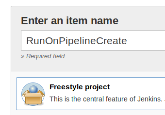
   
   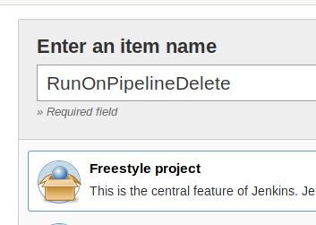
   
   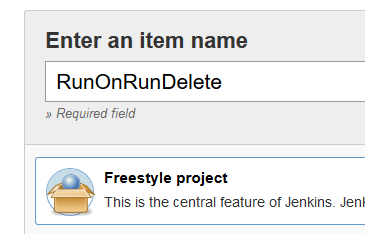

3. Create your Multi Branch Pipeline 

    Example screenshot:
    
    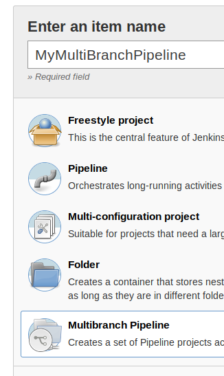

4. Define "Pipeline Action Triggers" Jobs at the bottom of the configuration page of the Multi Branch Pipeline.
    - This fields has Auto-Complete feature.
    - You can define more then one Job. All jobs defined in this fields will be triggered/built in the same time.
    - Do not forget to save configuration.
    
    Example screenshot:
    
    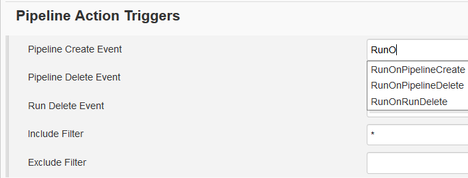
    
    Example screenshot:
    
    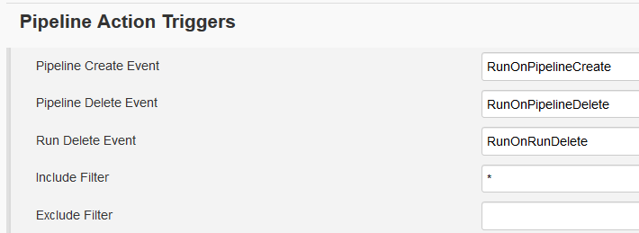
    
5. (Optional) Add filtering for triggering Jobs. In default, Trigger Jobs are build for all branches which is
    discovered by Branch Indexing. In some cases you may need to filter branches on which Trigger Jobs will be build.
    To achieve this you can define both Include and Exclude Filters (wildcard).
    
    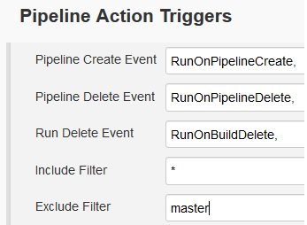

6. After Multi Branch Pipeline indexes the branches and creates Pipelines, you will notice that, Jobs that you defined
in "Pipeline Create Event" field has the same number of builds with the number of Pipelines. 
    - When you go to Configuration of the Jobs, you will notice that Build Parameter is defined automatically. 
    - Branch/Pipeline name value is passed to the job by parameter named "SOURCE_PROJECT_NAME". This parameter will have the
    name of the Pipeline/Branch which is created by Multi Branch Pipeline. For example if you only have master branch
    in your repository, this value will be "master".
    - Full name of the Branch/Pipeline is passed to the job by parameter named "SOURCE_PROJECT_FULL_NAME". This parameter will have the
     full name of the Pipeline/Branch which is created by Multi Branch Pipeline. For example if you only have master branch
    in your repository, this value will be "MyMultiBranchPipeline/master".
    - You can use this variable for your needs in your scripts/pipelines.
    
    Example screenshots:
    
    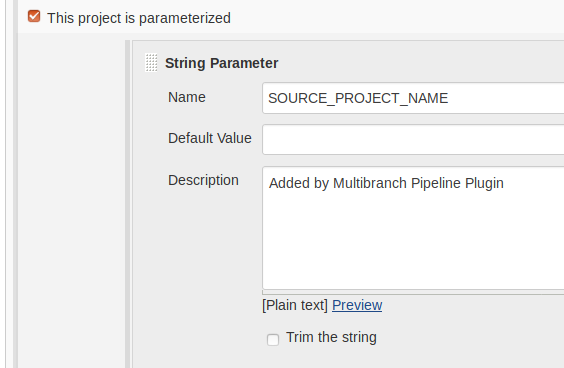
    
    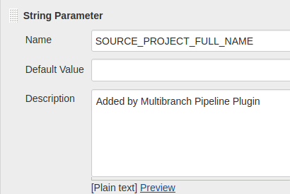
    
7. Whenever the Multi Branch Pipeline deletes a run (either by deleting the run, 
   or by deleting the complete branch), or whenever a run is deleted manually, 
   the Jobs that you defined in "Run Delete Event" will be executed. 
   Additionally to the parameters which are passed on branch creation or deletion,
   two other parameters ("SOURCE_RUN_NUMBER" and "SOURCE_RUN_DISPLAY_NAME") are passed 
   to the triggered job(s).
   
   Example Screenshots:
   
    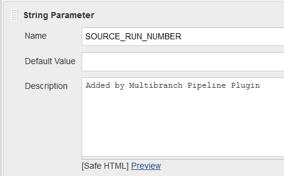
    
    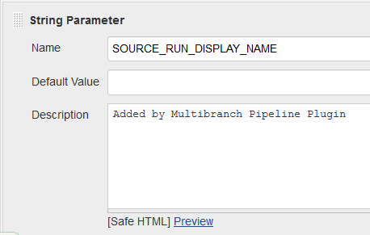
    
8. (Optional) Add additional parameters for passing to Triggering Jobs. Parameters which are defined in this section
   will be automatically defined in Trigger Jobs and values will be passed during the build.
   
   Example Screenshots:
   
   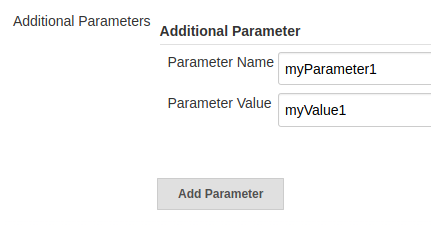
   
   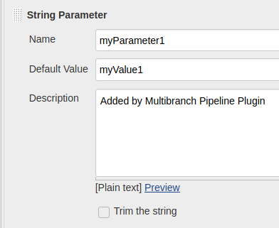
   
   
    
Reporting Issues
======
1. Login [Jenkins Jira](https://issues.jenkins-ci.org/secure/Dashboard.jspa) 
2. Create issue with component name "multibranch-action-triggers-plugin"

Nice time to have a coffee
=================
If you feel your self generous today, you can buy me a coffee : )
 
Or you can start the project.
Thanks.
 
 
